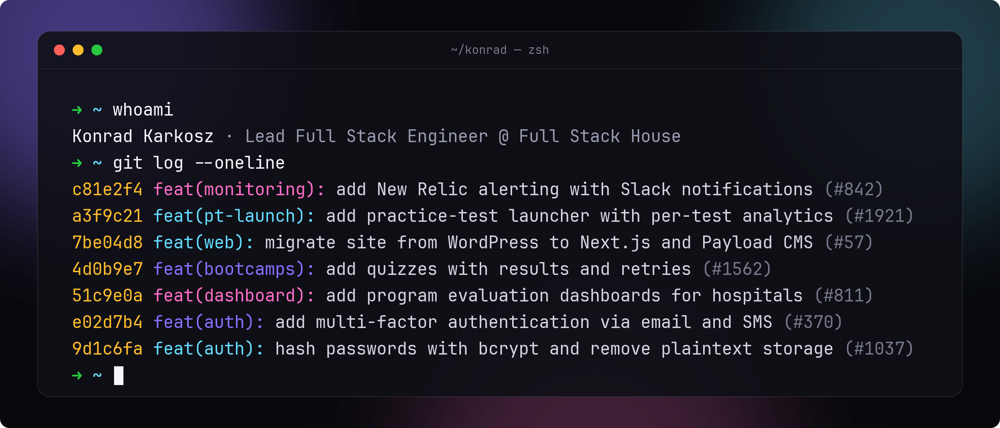

  <samp>
    <a href="https://zayooo-portfolio.vercel.app">portfolio</a> ·
    <a href="https://www.linkedin.com/in/konrad-karkosz">linkedin</a> ·
    <a href="mailto:kkarkosz00@gmail.com">email</a>
  </samp>

**Lead Full Stack Engineer** at [Full Stack House](https://fullstack.house). I build web products end-to-end in TypeScript: API, database, interface, infrastructure, all the way to production.

### Highlights

- **Sole engineer** on a medical SaaS platform used by hospitals and residency programs across the U.S., owning it from the database to production monitoring
- **Rebuilt its auth:** every password moved from plaintext to bcrypt, plus multi-factor login over email and SMS
- **Shipped** the practice-test launcher, quizzes and study plan of an LSAT prep platform
- **Migrated** a manufacturing client from WordPress to Next.js 15 + Payload CMS, solo

> [!NOTE]
> Most of my work lives in private client repositories, so this profile shows only part of it. My **[portfolio](https://zayooo-portfolio.vercel.app)** has the full picture.

### Stack

